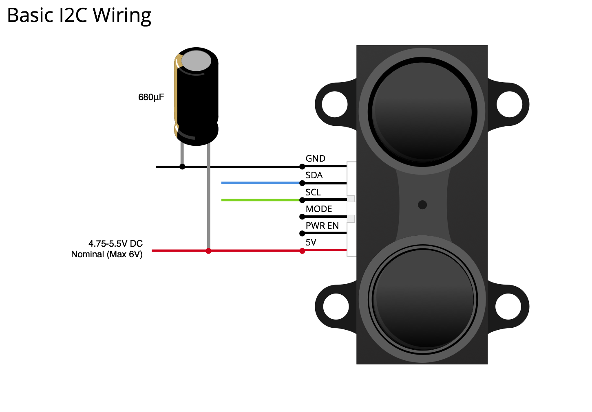
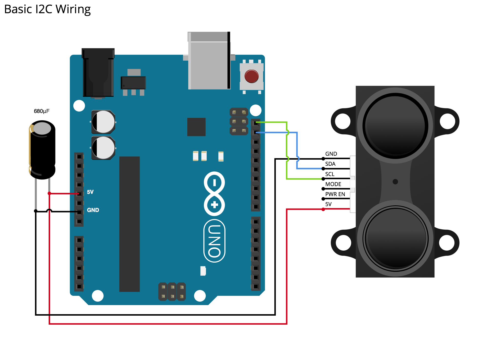
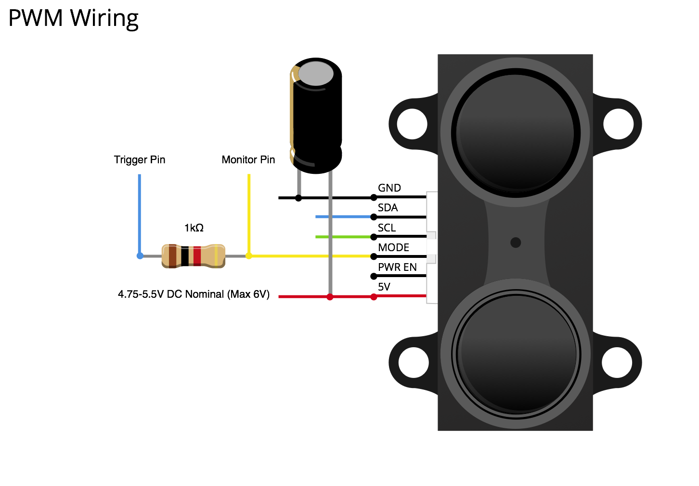
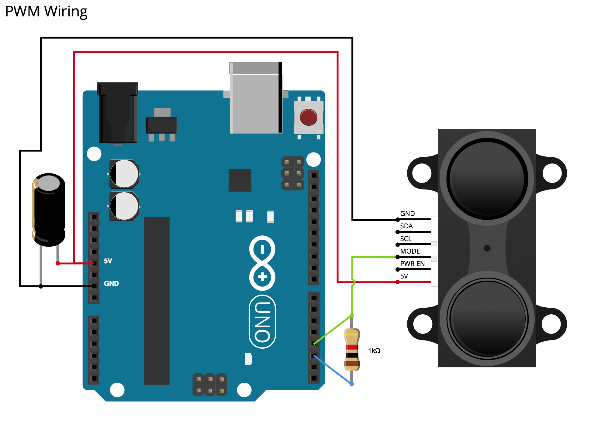
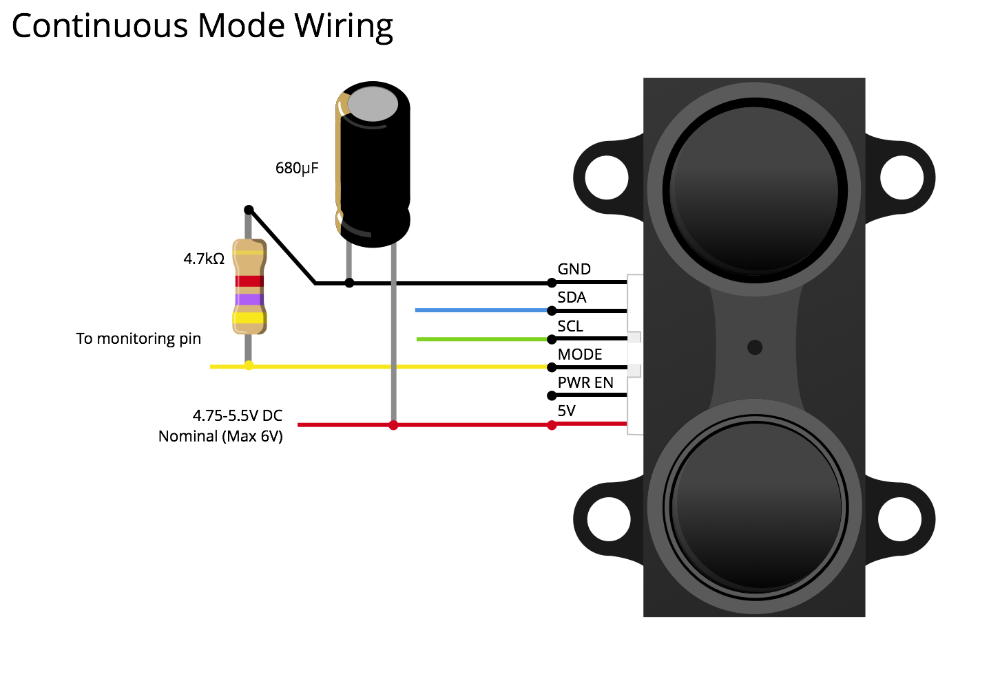
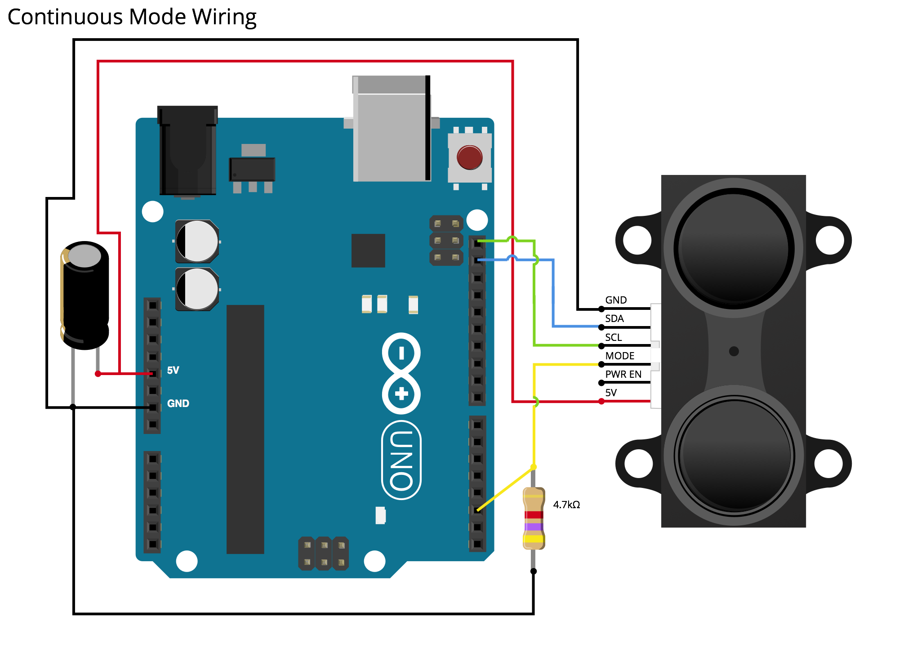
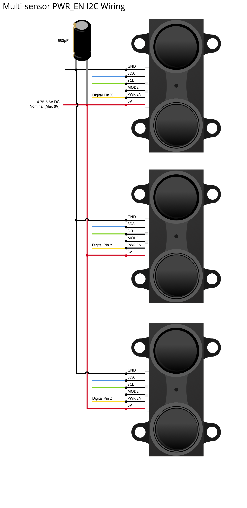
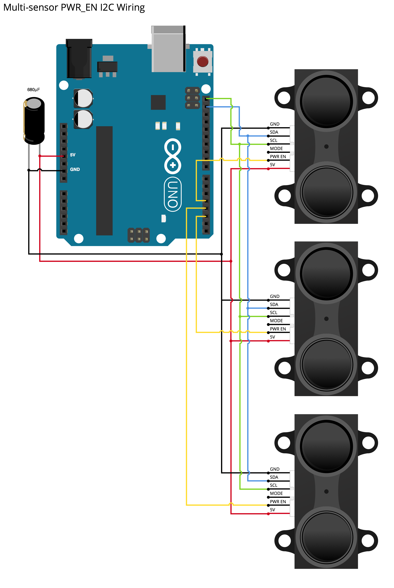

# LIDARLite_v2_Arduino_Library (BETA)

***NOTE:*** *This library is created specifically for LIDAR-Lite version 2 with the "Blue Label". See [http://pulsedlight3d.com](http://pulsedlight3d.com) for more information.*

The purpose of this library is two-fold:

1. Quick access all the basic functions of LIDAR-Lite via Arduino without worrying about specifics
2. By reading through this library, users of any platform will get an explanation of how to use the various functions of LIDAR-Lite and see an Arduino example along side.

Visit http://pulsedlight3d.com for documentation and support requests

This readme has the following sections:

- [Installation](#installation)
- [Wiring Diagrams](#wiring-diagrams)
	- [Basic I2C Wiring](#basic-i2c-wiring)
	- [PWM Wiring](#pwm-wiring)
	- [Continuous Mode Wiring](#continuous-mode-wiring)
	- [Multi-sensor PWR_EN Wiring](#multi-sensor-pwr_en-wiring)
- [Example Sketches](#example-sketches)
	- [Single Sensor](#single_sensor)
		- [Change_I2C_Address](#change_i2c_address)
		- [Correlation_Record_to_Array](#correlation_record_to_array)
		- [Correlation_Record_to_Serial](#correlation_record_to_serial)
		- [Distance_as_Fast_as_Possible](#distance_as_fast_as_possible)
		- [Distance_Continuous](#distance_continous)
		- [Distance_Single](#distance_single)
		- [PWM](#pwm)
		- [PWM_and_I2C](#pwm_and_i2c)
		- [Second_Return_Detect](#second_return_detect)
		- [Second_Return_Disable_Strongest](#second_return_disable_strongest)
		- [Velocity_Single](#velocity_single)
	- [Multiple Sensors](#multiple_sensors)
		- [Change_I2C_Addresses](#change_i2c_addresses)
- [Library Functions](#library-functions)
	- [begin](#begin)
	- [configure](#configure)
	- [beginContinuous](#beginContinuous)
	- [fast](#fast)
	- [distance](#distance)
	- [distanceContinuous](#distanceContinuous)
	- [scale](#scale)
	- [velocity](#velocity)
	- [signalStrength](#signalStrength)
	- [correlationRecordToArray](#correlationRecordToArray)
	- [correlationRecordToSerial](#correlationRecordToSerial)
	- [changeAddress](#changeAddress)
	- [changeAddressMultiPwrEn](#changeAddressMultiPwrEn)
	- write
	- read

# Installation

To install, download this repo put the "LIDARLite" folder in your Arduino "libraries" folder. If you need help, follow the instructions here: [http://arduino.cc/en/Guide/Libraries](http://arduino.cc/en/Guide/Libraries)

# Wiring Diagrams

## Basic I2C Wiring

The capacitor shown in these diagrams was useful with version one of the sensor and now is a virtual requirement because of the higher speeds of the sensor.

### Pinout



### Arduino


## PWM Wiring

### Pinout


### Arduino


## Continuous Mode Wiring

### Pinout


### Arduino


## Multi-sensor PWR_EN Wiring

### Pinout


### Arduino

# Example Sketches

## Single Sensor

### [Change_I2C_Address](LIDARLite/examples/Single%20Sensor/Change_I2C_Address/Change_I2C_Address.ino)
This example demonstrates how to chage the i2c address of a single sensor.
### [Correlation_Record_to_Array](LIDARLite/examples/Single%20Sensor/Correlation_Record_to_Array/Correlation_Record_to_Array.ino)
This example demostrates how to get the correlation record as an array and print it to the serial port
### [Correlation_Record_to_Serial](LIDARLite/examples/Single%20Sensor/Correlation_Record_to_Serial/Correlation_Record_to_Serial.ino)
This library demostrates how to print the correlation record to the serial port
### [Distance_as_Fast_as_Possible](LIDARLite/examples/Single%20Sensor/Distance_as_Fast_as_Possible/Distance_as_Fast_as_Possible.ino)
This example file demonstrates how to take distance measurements as fast as possible, when you first plug-in a LIDAR-Lite into an Arduino it runs 250 measurements per second (250Hz). Then if we setup the sensor by reducing the aquisiton record count by 1/3 and incresing the i2c communication speed from 100kHz to 400kHz we get about 500 measurements per second (500Hz). Now if we throttle the reference and preamp stabilization processes during the distance measurement process we can increase the number of measurements to about 750 per second (750Hz).
### [Distance_Continuous](LIDARLite/examples/Single%20Sensor/Distance_Continuous/Distance_Continuous.ino)
This example file will demonstrate how to tell the sensor to take a continous set of readings by writing the speed and number of measruments directly to the sensor, freeing the micro-controller to read when it is ready. We will con- figure the MODE pin to pull low when a new measrument is available.
### [Distance_Single](LIDARLite/examples/Single%20Sensor/Distance_Single/Distance_Single.ino)
This example file demonstrates how to take a single distance measurement with LIDAR-Lite v2 "Blue Label".
### [PWM (Coming Soon)](LIDARLite/examples/Single%20Sensor/PWM/PWM.ino)
This example demonstrates how to read measurements from LIDAR-Lite v2 "Blue Label" using PWM
### [PWM_and_I2C (Coming Soon)](LIDARLite/examples/Single%20Sensor/PWM_and_I2C/PWM_and_I2C.ino)
This example file will demonstrate how to use PWM and I2C at the same time, an exciting new feature of LIDAR-Lite
### [Second_Return_Detect (Coming Soon)](LIDARLite/examples/Single%20Sensor/Second_Return_Detect/Second_Return_Detect.ino)
This example will demostrate how to detect a second return, and if detected print the value
### [Second_Return_Disable_Strongest (Coming Soon)](LIDARLite/examples/Single%20Sensor/Second_Return_Disable_Strongest/Second_Return_Disable_Strongest.ino)
This example will demostrate how to disable showing strongest signal return  and print the second return if one is availble. This kind of approach can help  with window and chain link fence detection situation (amungst others).
### [Velocity_Single](LIDARLite/examples/Single%20Sensor/Velocity_Single/Velocity_Single.ino)
This example show how to read velocity with LIDAR-Lite "Blue Label" (V2)

## Multiple Sensors

### Change_I2C_Addresses
This example demonstrates how to chage the i2c address of multiple sensors.


# Library Functions

## Begin

Starts the sensor and I2C

### Process

1.  Turn on error reporting, off by default
2.  Start Wire (i.e. turn on I2C)
3.  Enable 400kHz I2C, 100kHz by default
4.  Set configuration for sensor

### Parameters

- **configuration**: set the configuration for the sensor
	- default or 0 = equivelent to writing 0x00 to 0x00, i.e. full reset of sensor, if you write nothing for configuration or 0, the sensor will initiate normally
    - 1 = high speed setting, set the aquisition count to 1/3 the default (works great for stronger singles) can be a little noisier
- **fasti2c**: if true i2c frequency is 400kHz, default is 100kHz
- **showErrorReporting**: if true reads with errors will print the value of 0x40, used primarily for debugging purposes by PulsedLight
- **LidarLiteI2cAddress (optional)**: Default: 0x62, the default LIDAR-Lite address. If you change the address, fill it in here.

### Function

```c++
    void LIDARLite::begin(int configuration, bool fasti2c, bool showErrorReporting, char LidarLiteI2cAddress){
      errorReporting = showErrorReporting;
      Wire.begin(); //  Start I2C
      if(fasti2c){
        #if ARDUINO >= 157
          Wire.setClock(400000UL); // Set I2C frequency to 400kHz, for the Due
        #else
          TWBR = ((F_CPU / 400000UL) - 16) / 2; // Set I2C frequency to 400kHz
        #endif
      }
      configure(configuration, LidarLiteI2cAddress);
    }
```

## Configure

Sets the configuration for the sensor, typically this is done in the begin() command, but sometimes (especially for multi-sensor applications) you will need to do this separately.

### Parameters
- **configuration**: set the configuration for the sensor
    - **default or 0** = equivelent to writing 0x00 to 0x00, i.e. full reset of
      sensor, if you write nothing for configuration or 0, the sensor will init-
      iate normally
    - **1** = high speed setting, set the aquisition count to 1/3 the default (works
      great for stronger singles) can be a little noisier

### Function

```c++
    void LIDARLite::configure(int configuration, char LidarLiteI2cAddress){
      switch (configuration){
        case 0: //  Default configuration
        break;
        case 1: //  Set aquisition count to 1/3 default value, faster reads, slightly
                //  noisier values
          write(0x04,0x00,LidarLiteI2cAddress);
        break;
      }
    }
```

## Begin Continuous

Continuous mode allows you to tell the sensor to take a certain number (or infinite) readings allowing you to read from it at a continuous rate. There is also an option to tell the mode pin to go low when a new reading is availble.

### Process

1.  Write our interval to register 0x45
2.  Write 0x20 or 0x21 (if we want the mode pin to pull low when a new reading is availble) to register 0x04
3.  Write the number of readings we want to take to register 0x11
4.  Write 0x04 to register 0x00 to begin taking measurements

### Parameters

- **modePinLow (optional)**: default is true, if true the Mode pin will pull low when a new measurement is availble
- **interval (optional)**: set the time between measurements, default is 0x04
- **numberOfReadings(optional)**: sets the number of readings to take before stopping (Note: even though the sensor will stop taking new readings, 0x8f will still read back the last recorded value), default value is 0xff (which sets the sensor to take infinite readings without stopping). Minimum value for operation is 0x02.
- **LidarLiteI2cAddress (optional)**: Default: 0x62, the default LIDAR-Lite address. If you change the address, fill it in here.

### Example Arduino Usage

```c++
	// Setup I2C then setup continuous mode
	myLidarLiteInstance.begin();
	myLidarLiteInstance.beginContinuous();
```

### Function

```c++
    void LIDARLite::beginContinuous(bool modePinLow, char interval, char numberOfReadings,char LidarLiteI2cAddress){
      //  Register 0x45 sets the time between measurements. 0xc8 corresponds to 10Hz
      //  while 0x13 corresponds to 100Hz. Minimum value is 0x02 for proper
      //  operation.
      write(0x45,interval,LidarLiteI2cAddress);
      //  Set register 0x04 to 0x20 to look at "NON-default" value of velocity scale
      //  If you set bit 0 of 0x04 to "1" then the mode pin will be low when done
      if(modePinLow){
        write(0x04,0x21,LidarLiteI2cAddress);
      }else{
        write(0x04,0x20,LidarLiteI2cAddress);
      }
      //  Set the number of readings, 0xfe = 254 readings, 0x01 = 1 reading and
      //  0xff = continuous readings
      write(0x11,numberOfReadings,LidarLiteI2cAddress);
      //  Initiate reading distance
      write(0x00,0x04,LidarLiteI2cAddress);
    }
```

## Distance

Read the distance from LIDAR-Lite

### Process

1.  Write 0x04 to register 0x00 to initiate an aquisition.
2.  Read register 0x01 (this is handled in the read() command)
	- if the first bit is "1" then the sensor is busy, loop until the first bit is "0"
	- if the first bit is "0" then the sensor is ready
3.  Read two bytes from register 0x8f and save
4.  Shift the FirstValueFrom0x8f << 8 and add to SecondValueFrom0x8f This new value is the distance.

### Parameters

- **stablizePreampFlag (optional)**: Default: true, take aquisition with DC stabilization/correction. If set to false, it will read faster, but you will need to sabilize DC every once in awhile (ex. 1 out of every 100 readings is typically good).
- **LidarLiteI2cAddress (optional)**: Default: 0x62, the default LIDAR-Lite address. If you change the address, fill it in here.

### Example Arduino Usage

```c++
	// take a reading with DC stabilization and the 0x62 default i2c address
	// the distance variable will hold the distance
	int distance = 0
	distance = myLidarLiteInstance.distance();

	// take a reading without DC stabilization and the 0x62 default i2c address
	int distance = 0
	distance = myLidarLiteInstance.distance(false);

	// take a reading with DC stabilization and a custom i2c address of 0x66
	int distance = 0
	distance = myLidarLiteInstance.distance(true,0x66);
```

### Notes

#### Autoincrement: A note about 0x8f vs 0x0f

Set the highest bit of any register to "1" if you set the high byte of a
register and then take succesive readings from that register, then LIDAR-
Lite automatically increments the register one for each read. An example: If
we want to read the high and low bytes for the distance, we could take two
single readings from 0x0f and 0x10, or we could take 2 byte read from reg-
ister 0x8f. 0x8f = 10001111 and 0x0f = 00001111, meaning that 0x8f is 0x0f
with the high byte set to "1", ergo it autoincrements.

### Function

```c++
    int LIDARLite::distance(bool stablizePreampFlag, bool takeReference, char LidarLiteI2cAddress){
      if(stablizePreampFlag){
        // Take acquisition & correlation processing with DC correction
        write(0x00,0x04,LidarLiteI2cAddress);
      }else{
        // Take acquisition & correlation processing without DC correction
        write(0x00,0x03,LidarLiteI2cAddress);
      }
      // Array to store high and low bytes of distance
      byte distanceArray[2];
      // Read two bytes from register 0x8f. (See autoincrement note above)
      read(0x8f,2,distanceArray,true,LidarLiteI2cAddress);
      // Shift high byte and add to low byte
      int distance = (distanceArray[0] << 8) + distanceArray[1];
      return(distance);
    }
```

## Distance Continuous

Reading distance while in continuous mode is as easy as reading 2 bytes from
register 0x8f

### Process

1. Read 2 bytes from 0x8f

### Parameters

- **LidarLiteI2cAddress (optional)**: Default: 0x62, the default LIDAR-Lite address. If you change the address, fill it in here.


### Example Arduino Usage

```c++
	// If using modePinLow = true, when the pin pulls low we take a reading
	if(!digitalRead(3)){ // Pin 3 is our modePin monitoring pin
		Serial.println(myLidarLite.distanceContinuous());
	}
```

### Function

```c++
    int LIDARLite::distanceContinuous(char LidarLiteI2cAddress){
      byte distanceArray[2]; // Array to store high and low bytes of distance
      read(0x8f,2,distanceArray,false,0x62); // Read two bytes from register 0x8f. (See autoincrement note above)
      int distance = (distanceArray[0] << 8) + distanceArray[1]; // Shift high byte and add to low byte
      return(distance);
    }
```

## Velocity Scaling

Measurement Period (ms)|Velocity 0x68 Load Value| Register| velocityScalingValue
:-----------| :---------------| :---------------| :-------------------
100         | 0.10 m/s        | 0xC8 (default)  | 1
40          | 0.25 m/s        | 0x50            | 2
20          | 0.50 m/s        | 0x28            | 3
10          | 1.00 m/s        | 0x14            | 4


### Process

1. Write the velocity scaling value from the table above to register 0x68

### Parameters

- **velocityScalingValue**: interger to choose the velocity scaling value, refer to the table above
- **LidarLiteI2cAddress (optional)**: Default: 0x62, the default LIDAR-Lite address. If you change the address, fill it in here.

### Example Usage

```c++
	// By default you don't need to set the scaling value, the sensor defaults
  	// to 0xC8 for register 0x68 or 0.10m/s

	// Set the velocity scaling to 1m/s
	myLidarLiteInstance.scale(4);
```

### Function

```c++
    void LIDARLite::scale(char velocityScalingValue, char LidarLiteI2cAddress){
      //  Array of velocity scaling values
      unsigned char scale[] = {0xC8, 0x50, 0x28, 0x14};
      //  Write scaling value to register 0x68 to set
      write(0x68,scale[velocityScalingValue],LidarLiteI2cAddress);
    }
```

## Velocity

A velocity is measured by observing the change in distance over a fixed time period. The default time period is 100 ms resulting in a velocity calibration of .1 m/s. Velocity mode is selected by setting the most significant bit of internal register 4 to one. When a distance measurement is initiated by writing a 3 or 4 (no dc compensation/or update compensation respectively) to command register 0, two successive distance measurements result with a time delay defined by the value loaded into register at address 0x68.

### Process

1.  Write 0x04 to register 0x00 to initiate an aquisition.
2.  Write 0x80 to register 0x04 to switch to velocity mode
3.  Read register 0x01
	- if the first bit is "1" then the sensor is busy, loop until the first
    bit is "0"
	- if the first bit is "0" then the sensor is ready
4.  Read one bytes from register 0x09 and save

### Parameters

- **LidarLiteI2cAddress (optional)**: Default: 0x62, the default LIDAR-Lite address. If you change the address, fill it in here.

### Example Usage

```c++
	//  Basic usage with default i2c address, the velocity variable will hold
	//  the velocity measurement
	int velocity = 0;
	velocity = myLidarLiteInstance.velocity();

	//  Get velocity with custom i2c address of 0x66
	int velocity = 0;
	velocity = myLidarLiteInstance.velocity(0x66);
```

### Function

```c++
    int LIDARLite::velocity(char LidarLiteI2cAddress){
      //  Write 0x04 to register 0x00 to start getting distance readings
      write(0x00,0x04,LidarLiteI2cAddress);
      //  Write 0x80 to 0x04 to switch on velocity mode
      write(0x04,0x80,LidarLiteI2cAddress);
      //  Array to store bytes from read function
      byte velocityArray[1];
      //  Read 1 byte from register 0x09 to get velocity measurement
      read(0x09,1,velocityArray,true,LidarLiteI2cAddress);
      //  Convert 1 byte to char and then to int to get signed int value for velo-
      //  city measurement
      return((int)((char)velocityArray[0]));
    }
```

## Signal Strength

The sensor transmits a focused infrared beam that reflects off of a target, with a portion of that reflected signal returning to the receiver. Distance can be calculated by taking the difference between the moment of signal transmission to the moment of signal reception. But successfully receiving a reflected signal is heavily influenced by several factors. These factors include: target distance, target size, aspect, reflectivity

The relationship of distance (D) to returned signal strength is an inverse square. So, with increase in distance, returned signal strength decreases by 1/D^2 or the square root of the distance.

Additionally, the relationship of a target's Cross Section (C) to returned signal strength is an inverse power of 4.  The LIDAR-Lite sensor transmits a focused near-infrared laser beam that spreads at a rate of approximately .5º as distance increases. Up to 1 meter it is about the size of the lens. Beyond 1 meter, approximate beam spread in degrees can be estimated by dividing the distance by 100, or ~8 milliradians. When the beam overfills (is larger than) the target, the signal returned decreases by 1/C^4 or the fourth root of the target's cross section.

The aspect of the target, or its orientation to the sensor, affects the observable cross section and, therefore, the amount of returned signal decreases as the aspect of the target varies from the normal.

Reflectivity characteristics of the target's surface also affect the amount of returned signal. In this case, we concern ourselves with reflectivity of near infrared wavelengths.

### Process

1.  Read one byte from 0x0e

### Parameters

- **LidarLiteI2cAddress (optional)**: Default: 0x62, the default LIDAR-Lite address. If you change the address, fill it in here.

### Example Usage

```c++
	//  Basic usage with default i2c address, the signalStrength variable will
	//  hold the signalStrength measurement
	int signalStrength = 0;
	signalStrength = myLidarLiteInstance.signalStrength();
```

### Function

```c++
    int LIDARLite::signalStrength(char LidarLiteI2cAddress){
      //  Array to store read value
      byte signalStrengthArray[1];
      //  Read one byte from 0x0e
      read(0x0e, 1, signalStrengthArray, false, 0x62);
      return((int)((unsigned char)signalStrengthArray[0]));
    }
```

## Correlation Record To Array

Distance measurements are based on the storage and processing of reference and signal correlation records. The correlation waveform has a bipolar wave shape, transitioning from a positive going portion to a roughly symmetrical negative going pulse. The point where the signal crosses zero represents the effective delay for the reference and return signals. Processing with the SPC determines the interpolated crossing point to a 1cm resolution along with the peak signal value.

### Process

1.  Take a distance reading (there is no correlation record without at least
  one distance reading being taken)
2.  Select memory bank by writing 0xc0 to register 0x5d
3.  Set test mode select by writing 0x07 to register 0x40
4.  For as many readings as you want to take (max is 1024)
	1.  Read two bytes from 0xd2
	2.  The Low byte is the value from the record
	3.  The high byte is the sign from the record

### Parameters

- **arrayToSave**: The array for saving the correlation record
- **numberOfReadings (optional)**: default is 256, max is 1024
- **LidarLiteI2cAddress (optional)**: Default: 0x62, the default LIDAR-Lite address. If you change the address, fill it in here.

### Example Usage

```c++
	// Default usage, correlationRecordArray will hold the correlation record
	int *correlationRecordArray;
	myLidarLiteInstance.distance();
	myLidarLiteInstance.correlationRecordToArray(correlationRecordArray);
```

### Function

```c++
    void LIDARLite::correlationRecordToArray(int *arrayToSave, int numberOfReadings, char LidarLiteI2cAddress){
      // Array to store read values
      byte correlationArray[2];
      // Var to store value of correlation record
      int correlationValue = 0;
      //  Selects memory bank
      write(0x5d,0xc0,LidarLiteI2cAddress);
      // Sets test mode select
      write(0x40, 0x07,LidarLiteI2cAddress);
      for(int i = 0; i<numberOfReadings; i++){
        // Select single byte
        read(0xd2,2,correlationArray,false,LidarLiteI2cAddress);
        //  Low byte is the value of the correlation record
        correlationValue = (int)correlationArray[0];
        // if upper byte lsb is set, the value is negative
        if(correlationArray[1] == 1){
          correlationValue |= 0xff00;
        }
        arrayToSave[i] = correlationValue;
      }
      // Send null command to control register
      write(0x40,0x00,LidarLiteI2cAddress);
    }
```

## Correlation Record To Serial Port

### Function

```c++
    void LIDARLite::correlationRecordToSerial(char separator, int numberOfReadings, char LidarLiteI2cAddress){

      // Array to store read values
      byte correlationArray[2];
      // Var to store value of correlation record
      int correlationValue = 0;
      //  Selects memory bank
      write(0x5d,0xc0,LidarLiteI2cAddress);
      // Sets test mode select
      write(0x40, 0x07,LidarLiteI2cAddress);
      for(int i = 0; i<numberOfReadings; i++){
        // Select single byte
        read(0xd2,2,correlationArray,false,LidarLiteI2cAddress);
        //  Low byte is the value of the correlation record
        correlationValue = correlationArray[0];
        // if upper byte lsb is set, the value is negative
        if((int)correlationArray[1] == 1){
          correlationValue |= 0xff00;
        }
        Serial.print((int)correlationValue);
        Serial.print(separator);
      }
      // Send null command to control register
      write(0x40,0x00,LidarLiteI2cAddress);
    }
```

## Change I2C Address for Single Sensor

LIDAR-Lite now has the ability to change the I2C address of the sensor and continue to use the default address or disable it. This function only works for single sensors. When the sensor powers off and restarts this value will be lost and will need to be configured again.

There are only certain address that will work with LIDAR-Lite so be sure to review the "Notes" section below

### Process

1.  Read the two byte serial number from register 0x96
2.  Write the low byte of the serial number to 0x18
3.  Write the high byte of the serial number to 0x19
4.  Write the new address you want to use to 0x1a
5.  Choose wheather to user the default address or not (you must to one of the following to commit the new address):
	1.  If you want to keep the default address, write 0x00 to register 0x1e
	2.  If you do not want to keep the default address write 0x08 to 0x1e

### Parameters

- **newI2cAddress**: the hex value of the I2C address you want the sensor to have
- **disablePrimaryAddress (optional)**: true/false value to disable the primary address, default is false (i.e. leave primary active)
- **currentLidarLiteAddress (optional)**: the default is 0x62, but can also be any value you have previously set (ex. if you set the address to 0x66 and disabled the default address then needed to change it, you would use 0x66 here)

### Example Usage

```c++
	//  Set the value to 0x66 with primary address active and starting with
	//  0x62 as the current address
	myLidarLiteInstance.changeAddress(0x66);
```

### Notes

#### Possible Address for LIDAR-Lite

7-bit address in binary form need to end in "0". Example: 0x62 = 01100010 so that works well for us. Essentially any even numbered hex value will work for 7-bit address.

8-bit read address in binary form need to end in "00". Example: the default 8-bit read address for LIDAR-Lite is 0xc4 = 011000100. Essentially any hex value evenly divisable by "4" will work.

### Function

```c++
    unsigned char LIDARLite::changeAddress(char newI2cAddress,  bool disablePrimaryAddress, char currentLidarLiteAddress){
      //  Array to save the serial number
      unsigned char serialNumber[2];
      unsigned char newI2cAddressArray[1];

      //  Read two bytes from 0x96 to get the serial number
      read(0x96,2,serialNumber,false,currentLidarLiteAddress);
      //  Write the low byte of the serial number to 0x18
      write(0x18,serialNumber[0],currentLidarLiteAddress);
      //  Write the high byte of the serial number of 0x19
      write(0x19,serialNumber[1],currentLidarLiteAddress);
      //  Write the new address to 0x1a
      write(0x1a,newI2cAddress,currentLidarLiteAddress);


      while(newI2cAddress != newI2cAddressArray[0]){
        read(0x1a,1,newI2cAddressArray,false,currentLidarLiteAddress);
      }
      Serial.print("WIN!");
      //  Choose whether or not to use the default address of 0x62
      if(disablePrimaryAddress){
        write(0x1e,0x08,currentLidarLiteAddress);
      }else{
        write(0x1e,0x00,currentLidarLiteAddress);
      }

      return newI2cAddress;
    }
```

## Change I2C Address for Multiple Sensors

Using the new I2C address change feature, you can also change the address for multiple sensors using the PWR_EN line connected to Arduino's digital pins.

Address changes will be lost on power off.

### Process


### Parameters

- **numberOfSensors**: int representing the number of sensors you have connected
- **pinArray**: array of the digital pins your sensors' PWR_EN line is connected to
- **i2cAddressArray**: array of the I2C address you want to assign to your sensors, the order should reflect the order of the pinArray (see not for possible addresses below)
- **usePartyLine(optional)**: true/false value of weather or not to leave 0x62 available to all sensors for write (default is false)

### Example Usage

```c++
	//  Assign new address to the sensors connected to sensorsPins and disable
	//  0x62 as a partyline to talk to all of the sensors
	int sensorPins[] = {2,3,4};
	unsigned char addresses[] = {0x66,0x68,0x64};
	myLidarLiteInstance.changeAddressMultisensor(3,sensorPins,addresses);
```

### Notes

#### Possible Address for LIDAR-Lite

7-bit address in binary form need to end in "0". Example: 0x62 = 01100010 so that works well for us. Essentially any even numbered hex value will work for 7-bit address.

8-bit read address in binary form need to end in "00". Example: the default 8-bit read address for LIDAR-Lite is 0xc4 = 011000100. Essentially any hex value evenly divisable by "4" will work.

### Function

```c++
  	void LIDARLite::changeAddressMultiPwrEn(int numOfSensors, int *pinArray, unsigned char *i2cAddressArray, bool usePartyLine){
      for (int i = 0; i < numOfSensors; i++){
        pinMode(pinArray[i], OUTPUT); // Pin to first LIDAR-Lite Power Enable line
        delay(2);
        digitalWrite(pinArray[i], HIGH);
        delay(20);
        configure(1);
        changeAddress(i2cAddressArray[i],true); // We have to turn off the party line to actually get these to load
      }
      if(usePartyLine){
        for (int i = 0; i < numOfSensors; i++){
          write(0x1e,0x00,i2cAddressArray[i]);
        }
      }
    }
```

## Write to LIDAR-Lite

### Function

```c++
    void LIDARLite::write(char myAddress, char myValue, char LidarLiteI2cAddress){
      Wire.beginTransmission((int)LidarLiteI2cAddress);
      Wire.write((int)myAddress);
      Wire.write((int)myValue);
      int nackCatcher = Wire.endTransmission();
      if(nackCatcher != 0){Serial.println("> nack");}
      delay(1);
    }
```

## Read from LIDAR-Lite

### Note

LIDAR-Lite requires a STOP then START from I2C, not a repeated START. If you're having trouble you might check what your I2C start/stop is like.

### Function

```c++
    void LIDARLite::read(char myAddress, int numOfBytes, byte arrayToSave[2], bool monitorBusyFlag, char LidarLiteI2cAddress){
      int busyFlag = 0;
      if(monitorBusyFlag){
        int busyFlag = 1;
      }
      int busyCounter = 0;
      while(busyFlag != 0){
        Wire.beginTransmission((int)LidarLiteI2cAddress);
        Wire.write(0x01);
        int nackCatcher = Wire.endTransmission();
        if(nackCatcher != 0){Serial.println("> nack");}
        Wire.requestFrom((int)LidarLiteI2cAddress,1);
        busyFlag = bitRead(Wire.read(),0);
        busyCounter++;
        if(busyCounter > 9999){
          if(errorReporting){
            int errorExists = 0;
            Wire.beginTransmission((int)LidarLiteI2cAddress);
            Wire.write(0x01);
            int nackCatcher = Wire.endTransmission();
            if(nackCatcher != 0){Serial.println("> nack");}
            Wire.requestFrom((int)LidarLiteI2cAddress,1);
            errorExists = bitRead(Wire.read(),0);
            if(errorExists){
              unsigned char errorCode[] = {0x00};
              Wire.beginTransmission((int)LidarLiteI2cAddress);    // Get the slave's attention, tell it we're sending a command byte
              Wire.write(0x40);
              delay(20);
              int nackCatcher = Wire.endTransmission();                  // "Hang up the line" so others can use it (can have multiple slaves & masters connected)
              if(nackCatcher != 0){Serial.println("> nack");}
              Wire.requestFrom((int)LidarLiteI2cAddress,1);
              errorCode[0] = Wire.read();
              delay(10);
              Serial.print("> Error Code from Register 0x40: ");
              Serial.println(errorCode[0]);
              delay(20);
            }
           }
          goto bailout;
        }
      }
      if(busyFlag == 0){
        Wire.beginTransmission((int)LidarLiteI2cAddress);
        Wire.write((int)myAddress);
        int nackCatcher = Wire.endTransmission();
        if(nackCatcher != 0){Serial.println("NACK");}
        Wire.requestFrom((int)LidarLiteI2cAddress, numOfBytes);
        int i = 0;
        if(numOfBytes <= Wire.available()){
          while(i < numOfBytes){
            arrayToSave[i] = Wire.read();
            i++;
          }
        }
      }
      if(busyCounter > 9999){
        bailout:
          busyCounter = 0;
          Serial.println("> Bailout");
      }
    }
```
